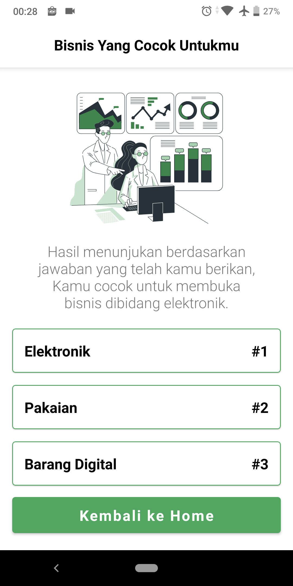

# Busaha-App
Busaha is an application that makes it easy for you to open and manage a business based on your characteristics. We build this app for The Bangkit 2022 final capstone project.
This app we build together with cloud and machine learning paths.

## Feature
- Login and Register
- Tes
- Trend 
- Berita ( coming soon )
- Riwayat ( coming soon )
- Pelatihan ( coming soon )
- Toko ( coming soon )

## Explaining main feature
The main feature in this app is Tes Usaha or Tes. The user is asked to enter an answer based on the questions that have been provided by the cloud. after that the answer will be processed by machine learning which will later provide recommendations for the top three businesses that are suitable for users.

## What we use in this app
- Clean Architecture
- Dependency Injection
- Retrofit
- Room
- Datastore Preference
- Tenserflow Lite

## how to use this app
- Clone the project from this repo
- Wait configuration in android studio
- You can use the App :)

## Preview in Video
- [Youtube](https://youtu.be/R-PcNHJpE7k)

## Preview App

